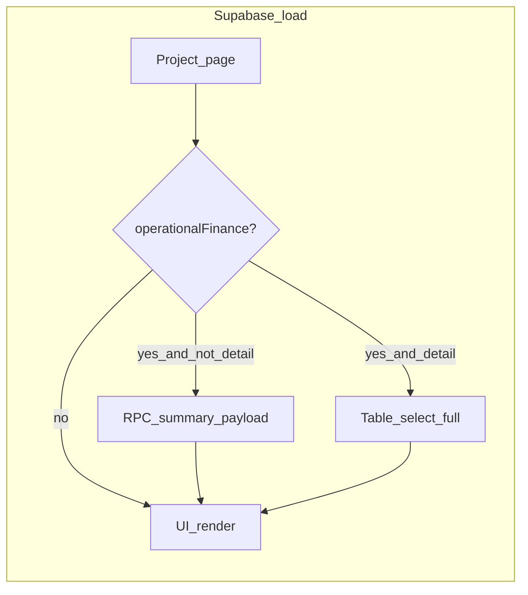

# Phase 6 — operational summary RPC wiring (`rovno`)

**Status:** implementation plan (reference)  
**Backend:** `rovno-db` — RPCs `get_procurement_operational_summary`, `get_estimate_operational_summary` (already migratable / deployed).  
**This doc:** lives in `rovno` so frontend work stays in the app repo.

**Product target:** Phase 6 `Permissions.md` — viewer/contractor **Procurement: summary** (Ordered / In stock: names, quantities, delivery; hide internal money); **Estimate: view** with client-safe story (cost/markup hidden; operational structure visible).

**Backend contract:** RPCs return **non-money** JSON for callers with `effective_finance_visibility in ('summary','detail')`. Table `SELECT` on `order_lines` / `procurement_items` / estimate line tables remains **detail-only** via RLS.

---

## Problem statement

- [`src/data/procurement-source.ts`](../src/data/procurement-source.ts) — `createSupabaseProcurementSource` loads only via `.from("procurement_items")` / `.from("order_lines")`, so **summary users get zero lines**.
- [`src/data/estimate-v2-store.ts`](../src/data/estimate-v2-store.ts) — `canAccessSensitiveEstimateRows` is owner **or** `financeVisibility === "detail"` only; **summary users lack a truthful hydrate path** from Postgres (checklist fallbacks are incomplete vs Permissions).
- [`src/lib/permissions.ts`](../src/lib/permissions.ts) — `seamCanViewSensitiveDetail` is **detail-only** (correct for money). There is no first-class helper for “operational summary allowed” (= summary **or** detail **or** owner).

---

## Design: two gates

| Gate | Meaning | Use for |
|------|---------|--------|
| **Operational finance** | Owner, or `finance_visibility in ('summary','detail')` | Fetching **rows** via RPC / non-money fields |
| **Sensitive detail** | `seamCanViewSensitiveDetail` (owner or `detail`) | **Money** columns, KPIs, price-derived totals |

Add e.g. `seamCanViewOperationalFinanceSummary(seam)` mirroring backend `effective_finance_visibility in ('summary','detail')` for non-owners with hydrated membership; owner `true`.

---

## Implementation checklist

### 1) Permissions helper

- File: [`src/lib/permissions.ts`](../src/lib/permissions.ts)
- Add `seamCanViewOperationalFinanceSummary` (or `seamCanLoadOperationalFinanceRows`): owner `true`; else require `membership` and `finance_visibility in ('summary','detail')`; unknown/missing → false (fail-closed, same spirit as sensitive detail).
- Reuse `FinanceVisibility` where applicable.
- Fix comments that equate “non-detail” with “no estimate rows” if misleading.

### 2) Procurement: RPC branch + mapping

- File: [`src/data/procurement-source.ts`](../src/data/procurement-source.ts)
- **Plumbing:** `getProcurementSource` / `createSupabaseProcurementSource` need **per-project finance context**. Pass `Pick<ProjectAuthoritySeam,...>` or `{ financeVisibility, role }` from call sites using [`usePermission`](../src/lib/permissions.ts).
- **Branching:**
  - If **sensitive detail** (`seamCanViewSensitiveDetail`): keep current `.from()` path (full `ProcurementItemV2` with cents).
  - Else if **operational summary** (`seamCanViewOperationalFinanceSummary`): `supabase.rpc('get_procurement_operational_summary', { p_project_id, p_limit, p_offset })`, parse JSON, map into existing `ProcurementItemV2[]` / order shapes for [`ProjectProcurement.tsx`](../src/pages/project/ProjectProcurement.tsx):
    - Fill **name, qty, unit, delivery** from `ordered_lines` + `procurement_items`.
    - Set **planned/actual prices** to null or 0; UI already gates money via `showSensitiveDetail` / [`OrderDetailModal.tsx`](../src/components/procurement/OrderDetailModal.tsx).
  - Else: return `[]` or equivalent “no access”.
- **Call sites:** [`src/hooks/use-procurement-source.ts`](../src/hooks/use-procurement-source.ts) and any direct `getProcurementSource()` — thread seam from `usePermission(projectId)`.
- **Note:** backend RPC excludes `requested` rows from the `procurement_items` bucket; **Ordered** should lean on `ordered_lines`. Align empty states.

### 3) Estimate v2: RPC hydrate for summary

- Files: [`src/data/estimate-v2-store.ts`](../src/data/estimate-v2-store.ts) (hydration), possibly [`src/data/estimate-source.ts`](../src/data/estimate-source.ts).
- When `financeVisibility === 'summary'` (and not detail), do **not** rely on table-backed `draft.lines` alone; call `get_estimate_operational_summary(p_project_id, current_version_id_or_null, ...)`.
- Map `works` + `resource_lines` → `EstimateV2Work` / `EstimateV2ResourceLine`:
  - `qtyMilli` from `quantity * 1000`
  - `costUnitCents` / markup: **0**; do not fake “client price” until schema supports it.
- Refine `canAccessSensitiveEstimateRows` vs a parallel **operational** flag so summary uses RPC hydrate but **does not** open hero/write paths that need full sensitive rows.
- Confirm `accessContextByProjectId` / `hydrateEstimateV2ProjectFromWorkspace` receives `financeVisibility`.

### 4) UI regression targets

- [`ProjectProcurement.tsx`](../src/pages/project/ProjectProcurement.tsx): do not treat `!canViewSensitiveDetail` as “no lines” when operational summary is true (e.g. “No ordered line items are visible…”).
- [`ProjectEstimate.tsx`](../src/pages/project/ProjectEstimate.tsx): resource table shows **qty + unit** for summary; stage money hidden when `!canViewSensitiveDetail`.

### 5) Tests

- [`ProjectProcurement.ordered.test.tsx`](../src/pages/project/ProjectProcurement.ordered.test.tsx): mock `supabase.rpc` with fixture JSON for summary; assert rows + no price columns.
- Estimate: hydration or store test with summary + RPC fixture.
- Leave demo/local paths on store-based behavior.

### 6) Contract / types

- RPCs: [`backend-truth/generated/supabase-types.ts`](../backend-truth/generated/supabase-types.ts). Use typed `.rpc()`; narrow `Json` returns at runtime.

---

## Non-goals (this pass)

- No new `rovno-db` migrations here.
- No invented “client-facing price” column.
- `finance_visibility = 'none'` stays empty on RPC; fix member/invite defaults in product/data if presets should be `summary` per Permissions.

---

## Manual verification

1. Viewer, `finance_visibility: summary` — Ordered: **titles, qty, unit, delivery**; no money columns.
2. Same user — SQL `select * from order_lines` → 0 rows; RPC returns payload.
3. Owner/detail — unchanged table path.
4. `none` — empty operational summary unless preset changes.

---

## Rollback

Revert app PR: drop RPC branches, restore pure `.from()` loading. Backend RPCs can stay unused.

---

## Task breakdown (optional)

1. `perm-helper` — permissions helper + docs in code comments  
2. `procurement-rpc` — source + hook plumbing + mapping  
3. `estimate-rpc` — store hydrate branch + mapping  
4. `ui-empty-states` — procurement + estimate copy/conditions  
5. `tests` — fixtures + assertions  
